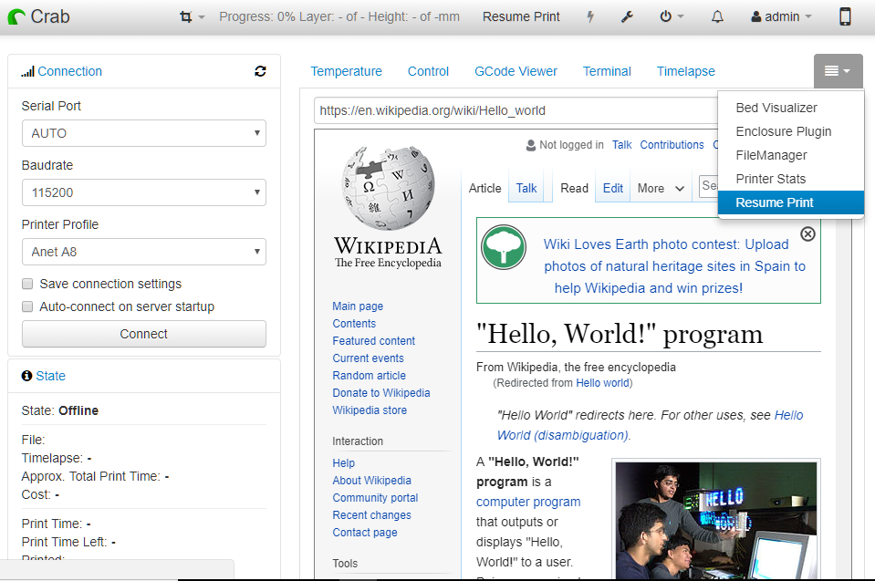

# OctoPrint-ResumePrint

This plugin allows the user to pause and/or stop any job print and then resume it from the same point in which the job was stopped. It is a useful way to manage any failure situation where the print job gets suddenly stopped, as it avoids to spoil it by enabling to resume without any impact.

## Setup

Install via the bundled [Plugin Manager](https://github.com/foosel/OctoPrint/wiki/Plugin:-Plugin-Manager)
or manually using this URL:

    https://github.com/mbserran/OctoPrint-ResumePrint/archive/devel.zip

## Settings

## Changelog

### [1.0.4] - 2018-05-20
- Version prepared for Octoprint update. Not functional.

### [1.0.3] - 2018-05-20
- Non functional version. First trials for Octoprint update.

### [1.0.1] - 2018-05-19
- First version based on Hello World plugin.

## Support My Efforts
I programmed this plugin for fun and do my best effort to support those that have issues with it, please return the favor and support me.

[1.0.4]: https://github.com/mbserran/OctoPrint-ResumePrint/tree/1.0.4
[1.0.3]: https://github.com/mbserran/OctoPrint-ResumePrint/tree/1.0.3
[1.0.1]: https://github.com/mbserran/OctoPrint-ResumePrint/tree/1.0.1
